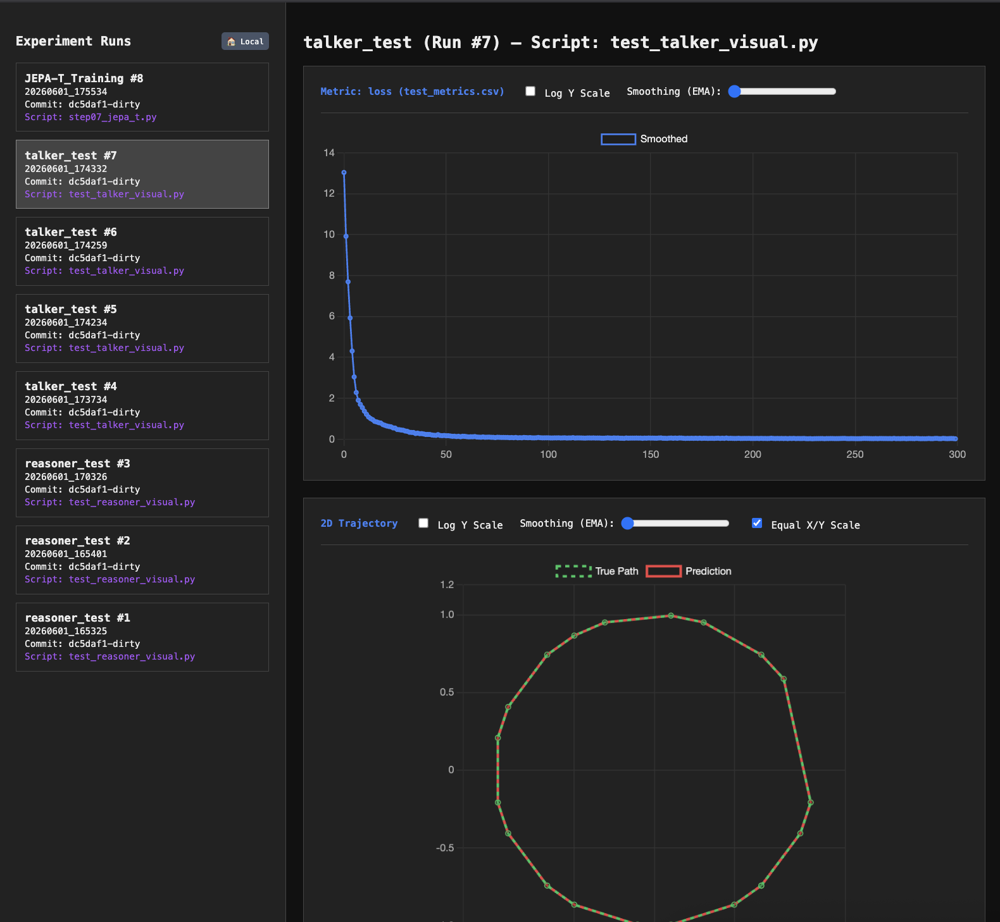

# trac_r

A local-first, cloud-native, lazy-loading ML experiment tracker. It runs completely locally out-of-the-box with zero configuration, and can optionally stream or sync your runs to Hugging Face Datasets.



## Installation
```bash
pip install git+https://github.com/AvikArefin/trac_r.git
```

or if you have uv installed we recommend

```
uv add git+https://github.com/AvikArefin/trac_r.git
```

## Usage
Launch the dashboard via:
```bash
trac-r
```
Or stream from the cloud:
```bash
trac-r --repo-id yourname/dataset
```
